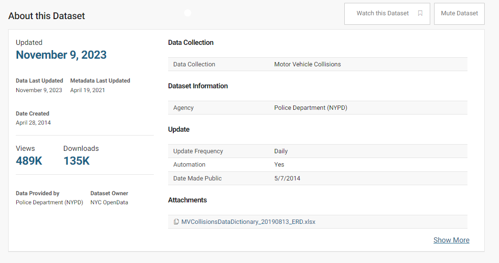
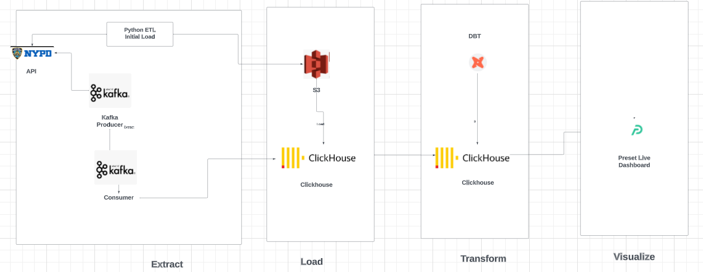
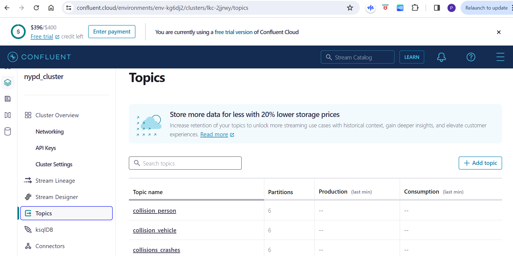
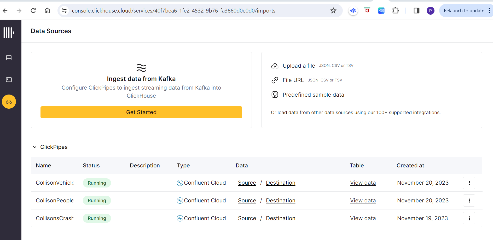
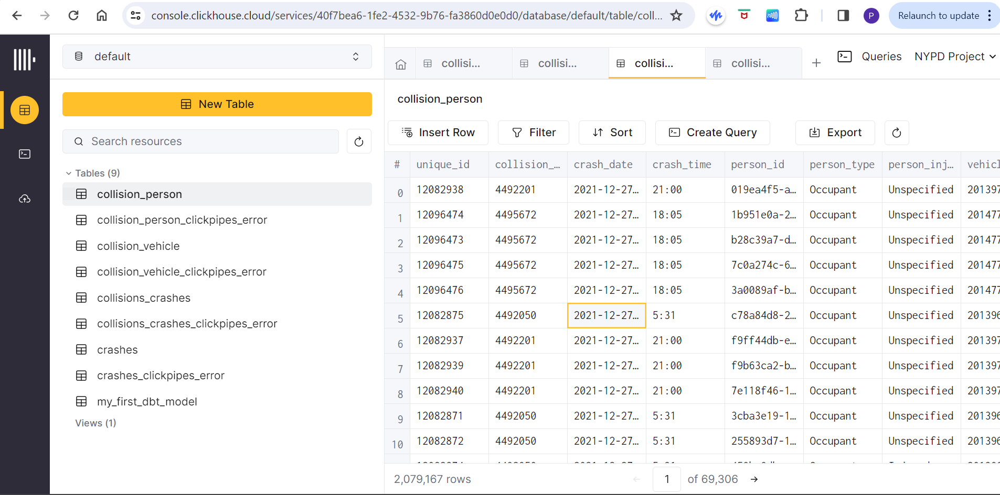
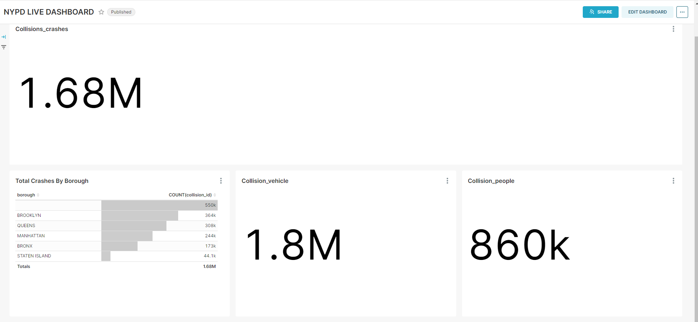
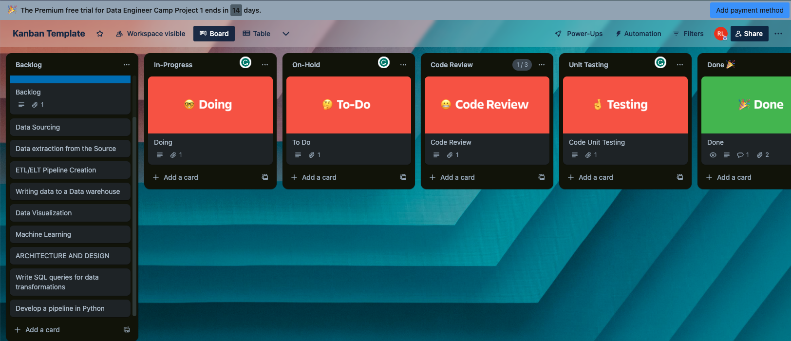

# FINAL CAPSTONE PROJECT OF THE DATA ENGINEERING BOOTCAMP

## PROJECT: BUILD A DATA PIPELINE TO INGEST THE NEW YORK POLICE DEPARTEMENT (NPDY) MOTOR VEHICLE COLISIONS AND CRASHES DATA THAT IS UPDATED EVERY MINUTE</h2>

[1. Objective of the project (What would you like people to do with the data you have produced?)](#objective-of-the-project-what-would-you-like-people-to-do-with-the-data-you-have-produced) 

[2. Consumers of your data (What users would find your dataset useful?)](#2-consumers-of-your-data-what-users-would-find-your-dataset-useful--nypd-news)

[3. Selected Dataset (What datasets are you sourcing from?)](#3-selected-dataset-what-datasets-are-you-sourcing-from)

[4. Solution architecture (How does data flow from source to serving?)](#4-solution-architecture-how-does-data-flow-from-source-to-serving)

[5. Breakdown of tasks (How is your project broken down? Who is doing what?)](#5-breakdown-of-tasks-how-is-your-project-broken-down-who-is-doing-what)

----------------------------------------------------------------------------------------

## 1. Objective of the project (What would you like people to do with the data you have produced?) 

Motor Vehicle Collisions - Crashes in the City of New York which is a real-time dataset updated daily, and which was made available to the public since 5/7/2014. That is provided by the Police Department of New York (NYPD). Our Goal is to have a live Dashboard which will have some of the questions listed below and summary of crashes on the dashboard updated every minute.

## 2. Consumers of your data (What users would find your dataset useful?) : NYPD, News 

SOME OF USE CASES TO ANSWER WITH THIS DATASET:

- The city authorities and NYPD should start implementing changes in at least these extremely risky areas in NYC.
- Additionally, there should be better reporting of the cause of accidents so measures can be taken accordingly
- A process should be set up to obtain a detailed report on the cause of the accident from insurance companies
- Finally, decisions that helped bring the counts of collisions down in 2019 should be further pursued.

Some of the questions the consumers could ask:

1. Number of collisions by years for each borough(borough by year)
2. Number of collisions by month for each borough (borough by month)
3. Number of collisions by day of the week for each borough (daily)
4. Number of collisions in half of the hour intervals for each borough
5. the percentage of people killed by year and borough
6. the percentage of people injured by year and borough
7. the percentage of accidents by causal factors in Manhattan
8. What are the top five most frequent contributing factors for
accidents in NYC?
9. What percentage of accidents had alcohol as a contributing factor?
10. What time of day sees the most cyclist injuries or deaths caused by a motor vehicle collision?
11. Which zip code had the largest number of nonfatal and fatal
accidents?
12. Which vehicle make, model, and year was involved in the most
accidents?
13. How does the number of collisions in an area of NYC correlate to the number of trees in the area?

## 3. Selected Dataset (What datasets are you sourcing from?)

NYC Open Data - Motor Vehicle Collisions - Crashs
NYC Open Data - Motor Vehicle Collisions - People
NYC Open Data - Motor Vehicle Collisions - Vehicles

The Motor Vehicle Collisions crash table contains details on the crash event. Each row represents a crash event. The Motor Vehicle Collisions data tables contain information from all police reported motor vehicle collisions in NYC. The police report (MV104-AN) is required to be filled out for collisions where someone is injured or killed, or where there is at least $1000 worth of damage (https://www.nhtsa.gov/sites/nhtsa.dot.gov/files/documents/ny_overlay_mv-104an_rev05_2004.pdf). It should be noted that the data is preliminary and subject to change when the MV-104AN forms are amended based on revised crash details.For the most accurate, up to date statistics on traffic fatalities, please refer to the NYPD Motor Vehicle Collisions page (updated weekly) or Vision Zero View (updated monthly).

https://data.cityofnewyork.us/Public-Safety/Motor-Vehicle-Collisions-Crashes/h9gi-nx95

## 4. Solution architecture (How does data flow from source to serving?) 

We extracted Collision data from three different dataset endpoints using python etl and loaded it to S3 bucket.We extracted 5 million records from api using the python script [DownloadDataFromAPI](NYPD_Assets\initialLoad\DownloadDataFromAPI.py), [DownloadDataFromAPIPeople.py](NYPD_Assets\initialLoad\DownloadDataFromAPIPeople.py) and [DownloadDataFromAPIVehicles.py](NYPD_Assets\initialLoad\DownloadDataFromAPIVehicles.py). And for realtime data, we used python Faker library to replicate orignal data and created a kafka producer which will publish three consumers using [confluent_producer_realtime.py](NYPD_Assets\incrementalLoad\confluent_producer_realtime.py).Each consumer will load data to Clickhouse 3 tables :- collision_crashes, collision_person,collision_vehicle as shown in pictures below. 

There we will do dimensional modeling to answer questions regarding different dimensions of collisons data using dbt. We will perform join in clickhouse to have multidimensional queries. For visualizing the streaming data we will be using preset which updated as data streams in, thus creating a live dataset and live dashboard.

## 5. Breakdown of tasks (How is your project broken down? Who is doing what?)

We have Broken down task as follows:

